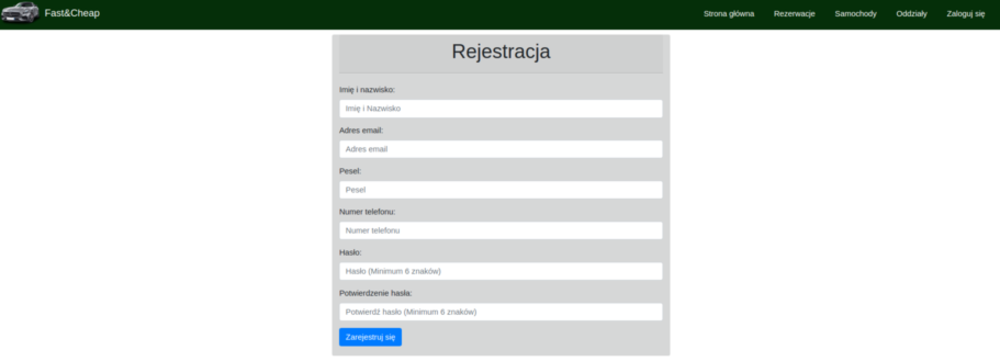
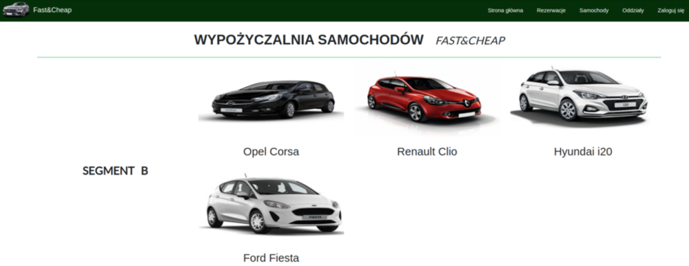

# Car Rental
> The application has been designed as rental car.

## Table of contents
* [General info](#general-info)
* [Features](#features)
* [Technologies](#technologies)
* [Status](#status)
* [Inspiration](#inspiration)

## General info
>The main feature of the application is rental car system. An unregistered user has the ability to view available cars, departments and have the option of register and sign in. 
Logged users can book cars, remove reservations, change profile data and delete their profile. Workers has the ability to check their orders. Coordinators can assign orders to employees.
Administrators can grant employee rights and change employee departments.

## Features

### User authentication and authorization
 
 
> Access to individual functionalities depends on the user's authorization, the application has three levels of authorization: 
guest, user, worker, coordinator and administrator. All data is validated and checked. 
By logging in, the user is checked the authorization level and access to individual functionalities.

### Guest view
 
> An unregistered user has the ability to check available cars, departments and have the option of register and sign in. 

 
>User has the ability to view available cars by segments.

 
>User has the ability to view available departments.

### Users view
>The logged in user, in addition to functionalities regarding guests, also have additional features. One of them is the ability to reservation cars.
 
> The first step of the booking is to choose the place, date and time of booking. All data is checked and only after checking the correctness of completing the form can you proceed to the next step

 
> The second step of booking is to choose a car from the list of available cars in a given time and in a given department.

 
> The third step of booking is the optional selection of additional equipment and the number of, for example child seats.

 
> The last step of the reservation is its summary with the simultaneous calculation of the total price of the reservation takes into account all the elements of the reservation that the user has entered

 
>  When the user has made a reservation, he can check the list of reservations, see the details and delete the reservation.

### Worker view

> Employees have access to orders assigned to them.

>### Coordinator view
 
 > Coordinators have the option of assigning orders to employees in a given branch.

>>### Admin view
  
  > Administrators have access to the list of all users and the ability to grant employee rights to users.

>
   > In addition, they have the option of changing the department and changing employees positions.

## Technologies
* Java SE 12
* Java EE 8
* Hibernate ORM 5.4.2
* REST API
* Docker
* Wildfly 17.0.1
* Maven 3.3.9
* Freemarker 2.3.29
* Bootstrap 4.3.1
* HTML5, CSS3, JS
* jQuery, AJAX

## Inspiration
Work in car rent company. 
